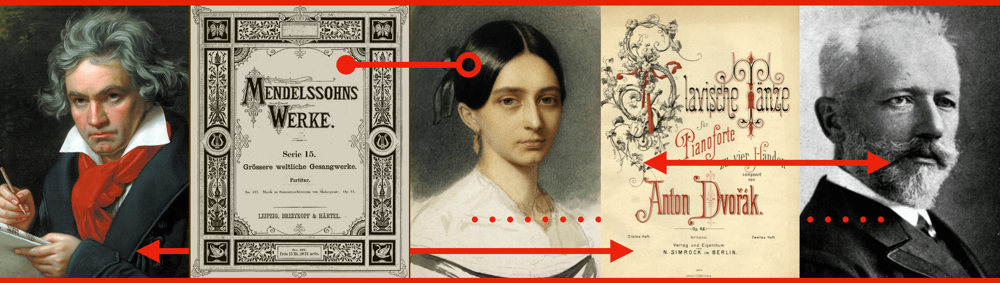

---
output:
  html_document:
    css: "StyleSheet.css"
title: "A Visual Guide to Some Nineteenth-Century Composers and Their Publishers"
---

Derek R. Strykowski, _University at Buffalo_



###### [Introduction](index.rmd)&nbsp;&nbsp;&nbsp; [I.&nbsp;The Composers](2Composers.rmd)&nbsp;&nbsp;&nbsp; [II.&nbsp;The&nbsp;Publishers](3Publishers.rmd)&nbsp;&nbsp;&nbsp; [III.&nbsp;Maps](4Maps.rmd)&nbsp;&nbsp;&nbsp; [Sources](5Sources.rmd)&nbsp;&nbsp;&nbsp;  

&nbsp;  

## I. The Composers
Ten composers are presently included in the guide: in alphabetical order, they are Ludwig van Beethoven (1770–1827), Hector Berlioz (1803–1869), Johannes Brahms (1833–1897), Antonín Dvořák (1841–1904), Edward MacDowell (1860–1908), Felix Mendelssohn (1809–1847), Clara Schumann (1819–1896), her husband Robert Schumann (1810-1856),  Richard Strauss (1864–1949), and Pyotr Tchaikovsky (1840–1893). Beethoven’s first publications date from the eighteenth century, while several others continued to compose well into the twentieth. Even so, all of the music that each composer published during his or her lifetime is included in the visualizations that follow.

The chart below compares the total number of authorized first editions that each composer in the project published during his or her lifetime.

### How Many Works Did Each Composer Publish?
```{r, echo = FALSE, message = FALSE}
composers_compared <- read.csv(file = 'ComposersCompared.csv')

library(ggplot2)
library(tidyverse)
library(dplyr)
library(plotly)

works_per_composer <- composers_compared %>%
  mutate(Composer = fct_rev(Composer)) %>%
ggplot( aes(x = Composer, y = Editions)) + 
     geom_bar(stat = "identity", fill = "red3", width = 0.5) +
     expand_limits(y = c(0,300)) +
     labs(x = NULL) +
     coord_flip()

ggplotly(works_per_composer, )
```

Naturally, some composers lived longer than others. Those who lived the longest, however, were not necessarily the most prolific. For example, Richard Strauss died at the age of 85 having published a total of 121 first editions, yet Felix Mendelssohn died at the age of 38 having published a total of 190.

A second chart, below, compares the number of different publishers (including musical periodicals) that printed the music of each composer in first edition during the composer’s lifetime.

### How Many Publishers Did Each Composer Have?
```{r, echo = FALSE, message = FALSE}
publishers_per_composer <- composers_compared %>%
  mutate(Composer = fct_rev(Composer)) %>%
ggplot( aes(x = Composer, y = Publishers)) + 
     geom_bar(stat = "identity", fill = "red3", width = 0.5) +
     expand_limits(y = c(0,50)) +
     labs(x = NULL) +
     coord_flip()

ggplotly(publishers_per_composer)
```

These numbers display a rough correlation to the total number of works that each composer published (above). For example, Ludwig van Beethoven worked with the greatest number of publishers and also published the most music. The composer who worked with the fewest publishers was Edward MacDowell, who also published less music than most of the others.
 
 <center><span style="color: #CD0000;">◀︎ • • • • • • • • • • • • ▶︎</span></center>

#### How to Cite These Visualizations
Strykowski, Derek R. “How Many Works Did Each Composer Publish?” Data visualization. _A Visual Guide to Some Nineteenth-Century Composers and Their Publishers._ 2020. https://dstrykowski.shinyapps.io/visualguide/

Strykowski, Derek R. “How Many Publishers Did Each Composer Have?” Data visualization. _A Visual Guide to Some Nineteenth-Century Composers and Their Publishers._ 2020. https://dstrykowski.shinyapps.io/visualguide/

<hr>

©2020 [Derek R. Strykowski](https://dstrykowski.com). This work is licensed under a [Creative Commons Attribution-NonCommercial 4.0 International License](http://creativecommons.org/licenses/by-nc/4.0/). The code is available on [GitHub](https://github.com/dstrykowski/visualguide).  
&nbsp;  
&nbsp;  