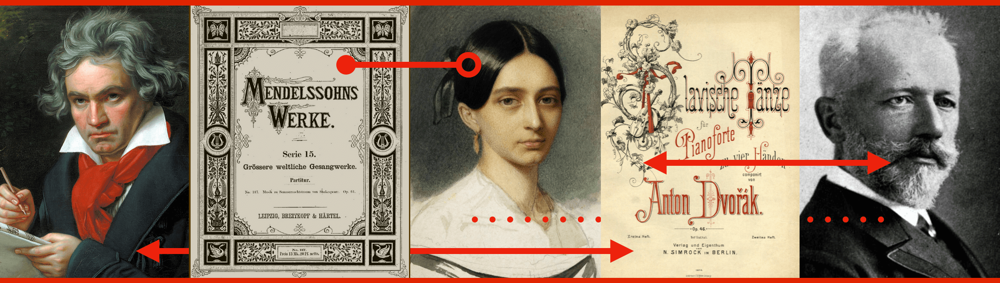

---
output:
  html_document:
    css: "StyleSheet.css"
title: "A Visual Guide to Some Nineteenth-Century Composers and Their Publishers"
---

Derek R. Strykowski, _University at Buffalo_

###### [Introduction](index.rmd)&nbsp;&nbsp;&nbsp;  [I.&nbsp;The&nbsp;Composers](2Composers.rmd)&nbsp;&nbsp;&nbsp;  [II.&nbsp;The&nbsp;Publishers](3Publishers.rmd)&nbsp;&nbsp;&nbsp; [III.&nbsp;Maps](4Maps.rmd)&nbsp;&nbsp;&nbsp; [Sources](5Sources.rmd)&nbsp;&nbsp;&nbsp;  

&nbsp;   

## Sources
Burghauser, Jarmil. _Antonín Dvořák: Thematisches Verzeichnis mit Bibliographie und Über- sicht des Lebens und des Werkes._ Kassel: Alkor-Edition, 1960.

Dorfmüller, Kurt, Norbert Gertsch, and Julia Ronge. _Ludwig van Beethoven: Thematisch-bibliographisches Werkverzeichnis._ 2 vols. Munich: G. Henle, 2014.

Holoman, D. Kern. _Catalogue of the Works of Hector Berlioz._ Kassel: Bärenreiter, 1987.

Koch, Paul-August. _Clara Wieck-Schumann (1819–1896), Komponistionen: Eine Zusammenstellung der Werke, Literatur und Schallplatten._ Frankfurt am Main: Zimmermann; Hofheim am Taunus: F. Hofmeister, 1991.

McCorkle, Margit L. _Johannes Brahms: Thematisch-bibliographisches Werkverzeichnis._ Munich: G. Henle, 1984.

McCorkle, Margit L. _Robert Schumann: Thematisch-Bibliographisches Werkverzeichnis._ Mainz: Schott, 2003.

Poznansky, Alexander. _The Tchaikovsky Handbook: A Guide to the Man and His Music._ Bloomington: Indiana University Press, 2002.

Sonneck, O. G. _Catalogue of First Editions of Edward MacDowell._ Washington: Library of Congress, 1917. Reprint. New York: Arno, 1971.

Strykowski, Derek R. “The Negotiation of Nineteenth-Century Style: A Case Study in Composer–Publisher Relations.” _International Review of the Aesthetics and Sociology of Music_ vol. 49, no. 2 (January 2019) [backdated to 2018]: 217–42.  [https://www.jstor.org/stable/26844645](https://www.jstor.org/stable/26844645) 

Trenner, Franz. _Richard Strauss: Werkverzeichnis._ Vienna: Doblinger, 1985.

Wehner, Ralf. _Felix Mendelssohn Bartholdy: Thematic-Systematic Catalogue of the Musical Works (MWV)._ Wiesbaden: Breitkopf & Härtel, 2009.
 

◀︎ • • • • • • • • • • • • ▶︎

#### How to Cite This Project
Strykowski, Derek R. _A Visual Guide to Some Nineteenth-Century Composers and Their Publishers._ 2020. https://dstrykowski.shinyapps.io/visualguide/

©2020 [Derek R. Strykowski](https://dstrykowski.com). This work is licensed under a [Creative Commons Attribution-NonCommercial 4.0 International License](http://creativecommons.org/licenses/by-nc/4.0/). The code is available on [GitHub](https://github.com/dstrykowski/visualguide).  
&nbsp;  
&nbsp;  